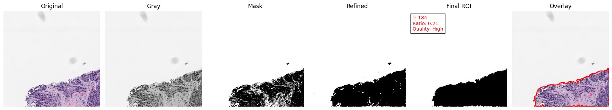

## ROI Segmentation Project

The main idea of this project is to extract the main tissue region from histopathology images in a simple and understandable way.

Instead of using ready-made functions from libraries like OpenCV, I tried to build the whole pipeline step by step using NumPy. This way, I could actually understand what is happening inside the algorithm, not just use a black-box function.

At the beginning, the image is converted to grayscale, because working with one channel is much easier and segmentation is mostly based on intensity. Then, I compute a threshold automatically using a method similar to Otsu. I implemented it manually so I could see how the threshold is chosen based on the image histogram.

After that, I create a binary mask and try to clean it using simple operations like dilation and erosion. These steps help remove small noise and connect broken parts of the tissue.

Then, I keep only the largest connected region, since in most cases the main tissue is the biggest part of the image. This helps get rid of small unwanted regions.

One problem I noticed was that sometimes small white holes appear inside the tissue. So I added a step to fill these holes, which makes the final result look cleaner and more consistent.

To better see the result, I also create an overlay image where the boundary of the segmented region is drawn on top of the original image. I made the boundary a bit thicker so it is easier to notice.

Another nice thing about this approach is that it does not depend on specific colors, so it can be used on different types of histopathology images without changing anything.

Overall, the goal of this project is not to build the best or fastest segmentation method, but to understand how these basic techniques work together in a clear and simple pipeline.

Finally, I added a simple command-line interface so the code can be run on different images without changing the source code.
This repository was developed as part of the final examination for the Software and Computing course in the Applied Physics program at the University of Bologna.

- - -
## What the project does


This project automatically identifies and extracts the main tissue region from a histopathology image.

The image is first converted to grayscale and segmented using a threshold computed from its intensity distribution. The resulting binary mask is then refined through morphological operations to reduce noise and improve region continuity.

Once the mask has been cleaned, connected regions are analyzed and the largest connected component is selected as the final Region of Interest (ROI). The pipeline also provides a basic quantitative analysis of the detected region and generates visual outputs showing each processing stage as well as the final segmentation boundaries overlaid on the original image.

The final output consists of:

A binary segmentation mask.
The extracted Region of Interest (ROI).
An overlay highlighting the detected tissue boundaries.
A tissue coverage ratio.
A qualitative label based on the detected tissue area.
A visualization of the complete segmentation workflow.

## Project Structure

```Markdown
##Project Structure

I tried to show that this project which is organized in a simple and clear way so that each part of the pipeline
and testing process is easy to understand and work with.

roi-segmentation-project/

├── roi_segmentation/            
   ├── __init__.py
   └── main.py                  
       # This file contains the full segmentation pipeline
       # including loading the image, thresholding, refinement,
       # region selection, analysis, and visualization.

├── tests/                       
   ├── test_load_image.py
   ├── test_threshold.py
   ├── test_refinement.py
   ├── test_region_selection.py
   ├── test_analysis.py
   ├── test_overlay.py
   └── test_pipeline.py
       # Each test focuses on one part of the pipeline.
       # Instead of checking fixed outputs, the tests verify
       # that the behavior of the code is correct.

├── data/                        
       # This part Contains sample input images used for testing the pipeline.

├── outputs/                     
       # This part Contains example outputs generated by the pipeline.

├── README.md                    
       # Project documentation and explanation.

├── requirements.txt             
       # List of required Python libraries.

├── .gitignore
├── LICENSE
└── .coverage                    
        # Coverage results generated during testing.
 


```
- - -

## Installation & Setup

This project has been tested with Python 3.10.11 on Windows, macOS, and Linux.
Before starting, make sure Python and Git are installed on your system.

You can check your Python installation by running:
python --version
python3 --version
git --version
If Python is not installed, download it from:
https://www.python.org/downloads/

- - -

1. Clone the Repository

Open your terminal and navigate to the directory where you want to download the project.

Then run:
```bash

git clone https://github.com/Ashkan-Soori/roi-segmentation-project.git

```
Move into the project folder:
```bash

cd roi-segmentation-project

```


2. Create a Virtual Environment

Although not mandatory, it is strongly recommended to create a virtual environment to keep dependencies isolated from your system Python installation.

On macOS / Linux:

```bash

python3 -m venv roi_env
source roi_env/bin/activate

```

On Windows:

```bash

python -m venv roi_env
roi_env\Scripts\activate

```

After activation, your terminal should show:

(roi_env)
This indicates that the virtual environment is active


3. Install Required Dependencies

```bash

pip install -r requirements.txt

```
This will install all necessary libraries including:


numpy
matplotlib
pytest
coverage

```Markdown

The `requirements.txt` file contains all installable dependencies required to run the application, execute tests, and generate coverage reports.

```

4. Verify Installation

```bash

python -m pytest -v

```

5. Run Tests with Coverage 

```bash

python -m coverage run --source=roi_segmentation -m pytest
python -m coverage report

```
6. Run the Application

Default mode (Otsu thresholding):

```bash

python -m roi_segmentation.main --image data/0_1009_0_0_0.jpg

```


## Running the Tests
Before running the tests, make sure:

You are inside the root directory of the project
All dependencies are installed (see Installation section)

To execute the full test suite, run the following command in your terminal:

```bash

python -m pytest -v

```

This will automatically discover and execute all test files inside the tests/ directory.

If everything is working correctly, you should see an output similar to:
```Markdown

10 passed in 0.xx seconds

```
This confirms that all components of the segmentation pipeline are functioning as expected


If everything is correctly installed, you should see all tests passing successfully.


1. Running Tests with Coverage

To evaluate how much of the source code is covered by the tests, run:

```bash

python -m coverage run --source=roi_segmentation -m pytest
python -m coverage report

```
This will display a coverage summary in the terminal, including:

Total number of statements
Number of missed lines
Overall coverage percentage

For a detailed HTML report, run:

```bash

python -m coverage html

```

```bash

start htmlcov/index.html

```
On Windows, use start htmlcov/index.html to open the report in your browser.

```Markdown

On Windows:
    start htmlcov/index.html

On macOS:
    open htmlcov/index.html

On Linux:
    xdg-open htmlcov/index.html

```


in your browser to inspect line-by-line coverage details.

Coverage Status

The test suite currently achieves 96% code coverage for the roi_segmentation module.

All core segmentation logic (image loading, thresholding, morphology, and main execution flow) is covered by tests.
The small percentage of uncovered lines corresponds to minor branches or visualization-related code.

- - -

 Test Environment

```Markdown

This project was tested on:

- Python 3.10.11
- Windows 10
- macOS

```

## Limitations and Notes

 please consider the following limitations:

1. Supported Image Formats

Only common image formats such as .jpg, .jpeg, and .png are supported.

Other formats may require manual conversion before processing.

All output masks are saved in .png format.

2. Intensity-Based Segmentation

The segmentation pipeline relies purely on grayscale intensity thresholding.

It does not use color-aware processing or machine learning models.

Performance may vary depending on image contrast, lighting conditions, or staining variability.

3. No Learning or Model Adaptation

This project does not include training, fine-tuning, or adaptive mechanisms.

It is a fully classical image processing implementation intended for educational purposes.

4. Binary Segmentation Only

The pipeline produces a binary mask distinguishing tissue from background.

Multi-class segmentation is not supported.

5. Command-Line Interface (CLI) Only

The application is designed to run from the command line.

No graphical user interface (GUI) is currently provided.

6. Sensitivity to Manual Threshold Selection

When using manual thresholding, the segmentation quality depends heavily on the selected threshold value.

An inappropriate threshold may lead to over-segmentation or under-segmentation.

- - -

## Image Attribution

The sample images used in this project were obtained from the publicly available IHC4BC – Compressed Dataset (HER2 subset) on Kaggle:

https://www.kaggle.com/datasets/akbarnejad1991/ihc4bc-compressed

The dataset is publicly accessible and is used in this project strictly for academic and educational purposes.

All rights and credits belong to the original dataset contributors.
For full licensing details and usage terms, please refer to the official Kaggle dataset page.

- - -

## Example Output

Below is an example of the full ROI segmentation pipeline applied to a sample HER2 histopathology image.

The figure shows all main processing stages from left to right:

- Original RGB image  
- Grayscale conversion  
- Initial binary mask after automatic thresholding  
- Refined mask after morphological operations  
- Final ROI after selecting the main region and removing internal holes  
- Overlay image with highlighted boundaries  

This pipeline not only segments the tissue region, but also improves the result by:
- Removing noise using morphology  
- Keeping only the largest connected region  
- Filling small holes inside the tissue  
- Highlighting the final boundary more clearly  

### Final Result




- - -

## License

This project is licensed under the [MIT License](LICENSE).


