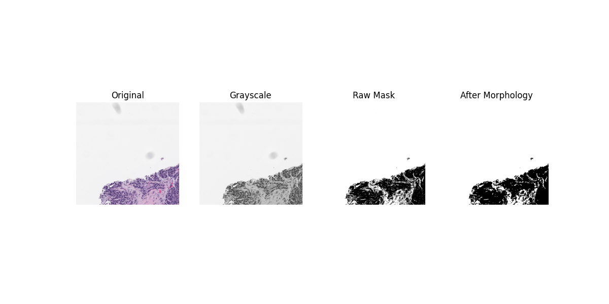

##ROI Segmentation Project

This project presents a classical image processing pipeline for Region of Interest (ROI) segmentation in histopathology images.

The main objective is to automatically extract tissue regions by applying grayscale thresholding and basic morphological operations. Instead of relying on deep learning models, the approach focuses on simplicity, interpretability, and reproducibility.

Because the segmentation is based on image intensity rather than color-specific features, the method works consistently for both H&E and IHC stained images.

The purpose of this project is not to achieve state-of-the-art performance, but to demonstrate how fundamental image processing techniques can effectively solve a basic medical image segmentation task in a clear and structured way.

This repository was developed as part of the final examination for the Software and Computing course in the Applied Physics curriculum at the University of Bologna.

- - -


## What the Project Does

The segmentation pipeline follows a clear and structured sequence of steps:

- Loading the input image  
- Converting it to grayscale  
- Applying thresholding (either Otsu or manual)  
- Cleaning the mask using morphological operations  
- Displaying the intermediate and final results  
- Automatically saving the output image  

The overall idea behind this project is to show how classical image processing techniques can effectively solve a basic segmentation task without relying on deep learning models.

---

##Installation & Setup

This project has been tested with Python 3.9–3.11 on Windows, macOS, and Linux.
Before starting, make sure Python and Git are installed on your system.

You can check your Python installation by running:
python --version
python3 --version
git --version
If Python is not installed, download it from:
https://www.python.org/downloads/
1. Clone the Repository

Open your terminal and navigate to the directory where you want to download the project.

Then run:
```bash

git clone https://github.com/Ashkan-Soori/roi-segmentation-project.git

```
Move into the project folder:
```bash

cd roi-segmentation-project

```
---

2. Create a Virtual Environment

Although not mandatory, it is strongly recommended to create a virtual environment to keep dependencies isolated from your system Python installation.

On macOS / Linux:

```bash

python3 -m venv roi_env
source roi_env/bin/activate

```

On Windows:

```bash

python -m venv roi_env
roi_env\Scripts\activate

```

After activation, your terminal should show:

(roi_env)
This indicates that the virtual environment is active


3. Install Required Dependencies

```bash

pip install -r requirements.txt

```
This will install all necessary libraries including:

numpy
opencv-python
matplotlib
pytest
coverage

4. Verify Installation

```bash

pytest

```

5. Run Tests with Coverage 

```bash

python -m coverage run --source=roi_segmentation -m pytest
python -m coverage report

```
6. Run the Application

Default mode (Otsu thresholding):

```bash

python -m roi_segmentation.main --image data/0_1009_0_0_0.jpg

```
Manual thresholding example:

```bash

python -m roi_segmentation.main --image data/0_1009_0_0_0.jpg --method manual --threshold 180

```


To generate a coverage report:


Run the test suite to confirm everything is working:


**How to Run**


Open a terminal (CMD on Windows) and make sure you are inside the root folder of the project.


Default method (Otsu thresholding)


**On Windows**:


python -m roi\_segmentation.main --image data\\0\_1009\_0\_0\_0.jpg


On macOS/Linux:


python3 -m roi\_segmentation.main --image data/0\_1009\_0\_0\_0.jpg


**Manual thresholding**


On Windows:


python -m roi\_segmentation.main --image data\\0\_1009\_0\_0\_0.jpg --method manual --threshold 180


On macOS/Linux:


python3 -m roi\_segmentation.main --image data/0\_1009\_0\_0\_0.jpg --method manual --threshold 180


**Available Arguments**


\--image : path to the input image (required)

\--method : choose between "otsu" (default) or "manual"

\--threshold : threshold value used only in manual mode

\--kernel : kernel size used for morphological operations


**Output**


When the script runs, it shows four images:


Original image

Grayscale version

Raw threshold mask

Cleaned mask after morphology


The final result is automatically saved inside the Outputs/ folder.

If the folder does not exist, it will be created automatically.


All output images are saved in PNG format.


**Project Structure**


roi-segmentation-project/

* &#x20;data/ # Input images
* &#x20;roi\_segmentation/ # Main segmentation code
* &#x20;tests/ # Basic unit tests
* &#x20;Outputs/ # Saved results
* &#x20;requirements.txt
* &#x20;README.md/
* 

**Notes**


ROI Segmentation Project

This project implements a simple Region of Interest (ROI) segmentation pipeline using classical image processing techniques.

The main goal is to extract tissue regions from histopathology images by applying thresholding and basic morphological operations. The method is fully intensity-based, which means it works for both H&E and IHC images without relying on color-specific assumptions or deep learning models.

This repository was developed for the final examination of the Software and Computing course in the Applied Physics curriculum at the University of Bologna.

Project Idea

Instead of using deep learning, this project demonstrates how far we can go using classical image processing.

The pipeline is intentionally simple and transparent. Every step is visible and understandable:

Load the input image
Convert it to grayscale
Apply thresholding (Otsu or manual)
Clean the mask using morphology
Display intermediate results
Save the final segmentation automatically

The focus is clarity, reproducibility, and structured code organization.

Installation

Make sure Python 3.9 or newer is installed.

All required libraries are listed in requirements.txt.

From the root directory of the project, run:

pip install -r requirements.txt
Project Structure
roi-segmentation-project/
│
├── data/                  # Input images
├── roi_segmentation/      # Main segmentation module
├── tests/                 # Unit tests
├── Outputs/               # Saved segmentation results
├── requirements.txt
└── README.md
How to Run the Project

Open a terminal (CMD on Windows) and make sure you are inside the root folder of the project.

Default Mode (Otsu Thresholding)
On Windows
python -m roi_segmentation.main --image data\0_1009_0_0_0.jpg
On macOS/Linux
python3 -m roi_segmentation.main --image data/0_1009_0_0_0.jpg

Otsu thresholding automatically determines the best threshold value based on the image histogram.

Manual Thresholding

If you want to manually control the threshold:

On Windows
python -m roi_segmentation.main --image data\0_1009_0_0_0.jpg --method manual --threshold 180
On macOS/Linux
python3 -m roi_segmentation.main --image data/0_1009_0_0_0.jpg --method manual --threshold 180

Manual mode allows experimenting with different threshold values depending on image contrast.

Available Arguments
Argument	Description
--image	Path to the input image (required)
--method	"otsu" (default) or "manual"
--threshold	Threshold value (used only in manual mode)
--kernel	Kernel size for morphological operations
Output

When the script runs, it displays four images:

Original image
Grayscale image
Raw threshold mask
Cleaned mask after morphology

The final result is automatically saved inside the Outputs/ folder.
If the folder does not exist, it will be created automatically.

All output files are saved in PNG format.

**Example Output**


Below is a sample result showing the full processing pipeline (original image, grayscale, raw mask, and cleaned mask):

\### Otsu Method


\### Manual Threshold (180)


### Otsu Method


### Manual Threshold (180)
